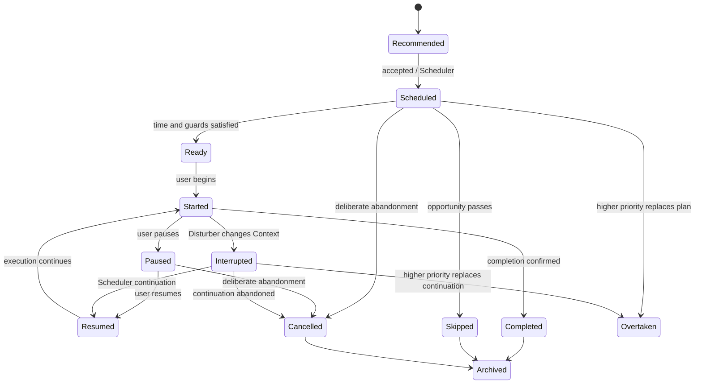
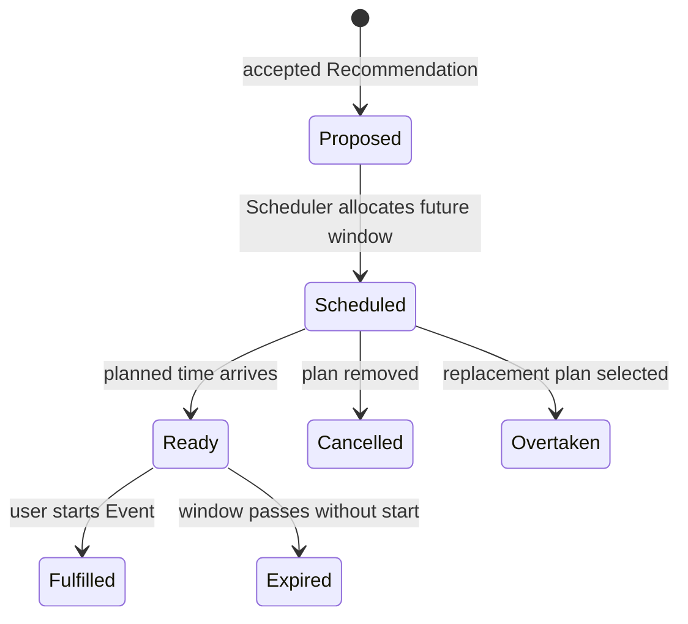
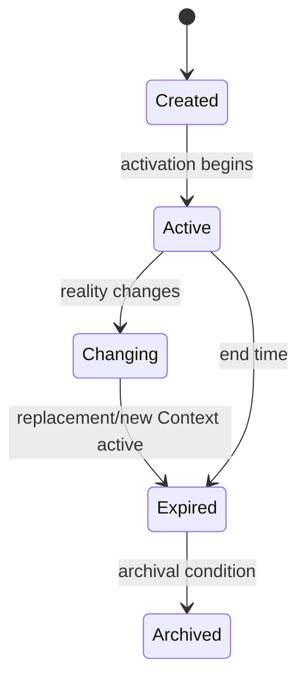
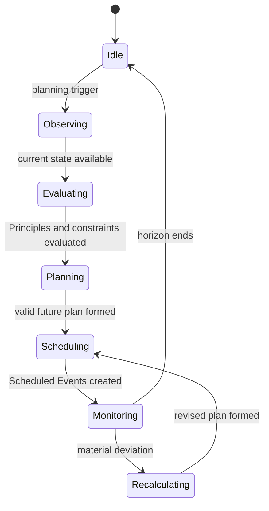
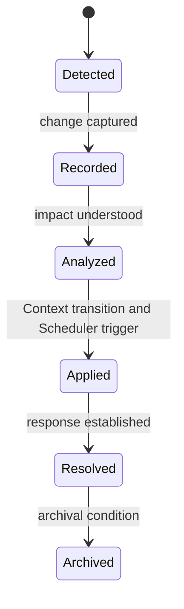
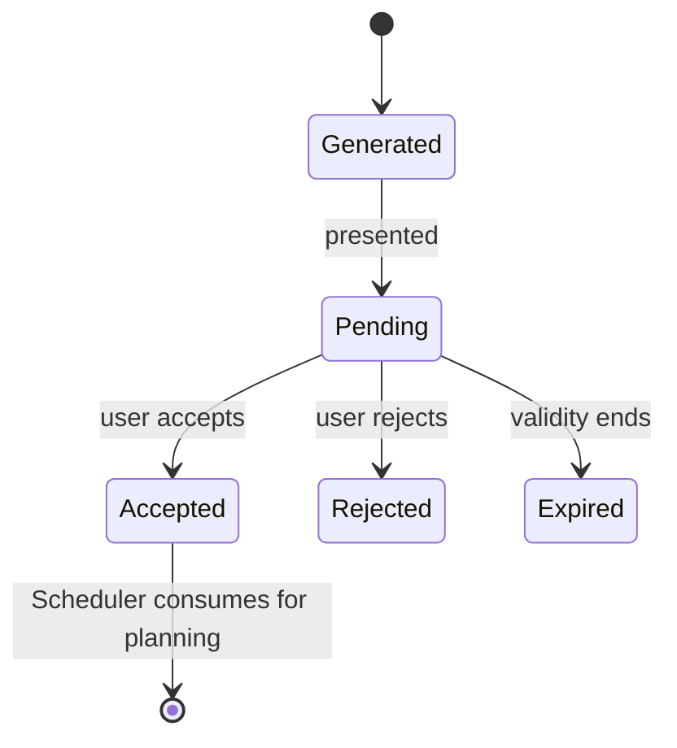
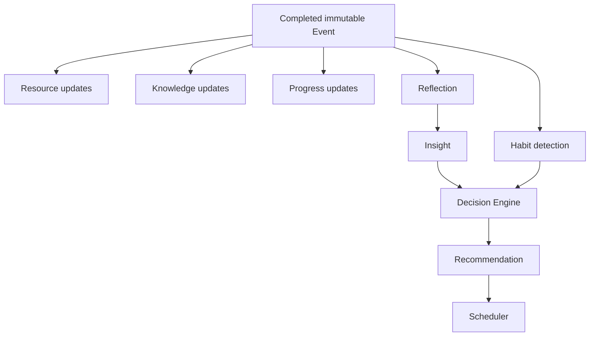

# PAIOS Behavioral State Machines

## Purpose and invariants

This is the formal behavioral specification for PAIOS state transitions. A transition appends lifecycle evidence; it never rewrites completed Event History.

- Events are immutable historical truth.
- Scheduler controls Event transitions and only changes future plans.
- Decision Engine owns no data and produces Recommendations only.
- Event Disturbers never modify Events directly: `Disturber → Context Window transition → Scheduler recalculation → Event transition`.
- Principles constrain every Recommendation and Scheduler decision.
- No Task entity exists.

Each transition table records source, target, trigger, responsible actor, preconditions, and resulting domain event. **Actor** is the authority that applies the transition, even when a user action or clock condition supplies the trigger.

---

# 1. Event Lifecycle State Machine

## Purpose

Event state answers: **“What lifecycle phase is this Event in?”** It does not answer what result occurred.

## States

| State | Meaning |
|---|---|
| `Recommended` | Decision Engine suggestion has not been accepted for planning. |
| `Scheduled` | Scheduler placed a future Event in a Context Window. |
| `Ready` | Planned start is current; Context and Resources permit execution. |
| `Started` | User began the Event. |
| `Paused` | User temporarily paused the Event. |
| `Resumed` | A Paused or Interrupted Event continues. |
| `Completed` | Execution ended; immutable historical Event. |
| `Skipped` | Scheduled opportunity passed without a start. |
| `Cancelled` | A future, paused, or interrupted Event was deliberately abandoned. |
| `Interrupted` | External reality temporarily stopped execution. |
| `Overtaken` | A Principle-constrained higher-priority Event replaced it. |
| `Archived` | Terminal History is outside active reporting. |

## Formal transitions

| Source | Target | Trigger | Actor | Preconditions | Resulting domain event |
|---|---|---|---|---|---|
| `Recommended` | `Scheduled` | User acceptance | Scheduler | Valid Recommendation; Principles, Context, Time, Resources permit plan | `ScheduledEventCreated` |
| `Scheduled` | `Ready` | Planned time arrives | Scheduler | Current Context Window and Resources satisfy plan | `EventReady` |
| `Ready` | `Started` | User begins | Scheduler | Event is Ready; no overriding constraint | `EventStarted` |
| `Started` | `Paused` | User pauses | Scheduler | Event is Started | `EventPaused` |
| `Paused` | `Resumed` | User resumes | Scheduler | Continuation is viable | `EventResumed` |
| `Interrupted` | `Resumed` | Recalculation permits continuation | Scheduler | Valid continuation exists | `EventResumed` |
| `Resumed` | `Started` | Execution continues | Scheduler | User continues action | `EventStarted` |
| `Started` or `Resumed` | `Completed` | Completion confirmed | Scheduler | Actual execution occurred | `EventCompleted` |
| `Scheduled` | `Skipped` | Opportunity passes | Scheduler | No start occurred before window ended | `EventSkipped` |
| `Scheduled`, `Paused`, or `Interrupted` | `Cancelled` | Deliberate abandonment | Scheduler | Authorized cancellation | `EventCancelled` |
| `Started` | `Interrupted` | Disturber causes Context transition | Scheduler | Material Context change is recorded | `EventInterrupted` |
| `Scheduled` or `Interrupted` | `Overtaken` | Higher-priority replacement | Scheduler | Replacement respects Principles | `EventOvertaken` |
| `Completed`, `Skipped`, or `Cancelled` | `Archived` | Archival condition | Scheduler | Terminal state | `EventArchived` |

## Invalid transitions

- `Recommended → Started` or `Completed`; a Recommendation is not execution.
- `Scheduled → Completed`; a plan is not proof of action.
- `Completed →` any active state; completed History is immutable.
- `Skipped`, `Cancelled`, `Overtaken`, or `Archived → Ready`; later opportunity requires a new Scheduled Event.
- Direct Disturber → Event state; the mandatory Context/Scheduler path must occur.

## Event outcome

Outcome answers: **“What actually happened?”** It is an immutable result recorded alongside the Event lifecycle, not a competing lifecycle state.

| Outcome | Meaning |
|---|---|
| `Completed` | Intended action and outcome were achieved. |
| `Partial` | Some execution occurred but intended scope was not fully achieved. |
| `Failed` | Execution occurred but intended outcome was not achieved. |
| `Abandoned` | Execution or continuation was deliberately ended. |

`Completed` state normally has `Completed` outcome. `Cancelled` or `Overtaken` may have no execution outcome; an interrupted Event that is cancelled may record `Partial` or `Abandoned` outcome. Outcome never permits alteration of Event History.

---

# 2. Scheduled Event Lifecycle

## Purpose

Scheduled Event is the Scheduler-owned future planning object, separate from completed Event History.

| Source | Target | Trigger | Actor | Preconditions | Resulting domain event |
|---|---|---|---|---|---|
| `Proposed` | `Scheduled` | Scheduler allocates time/context | Scheduler | Principles and constraints pass | `ScheduledEventCreated` |
| `Scheduled` | `Ready` | Time and Context align | Scheduler | Resource/Context guards pass | `EventReady` |
| `Ready` | `Fulfilled` | User starts | Scheduler | Actual start observed | `EventStarted` |
| `Scheduled` | `Cancelled` | Plan removed | Scheduler | Future-only change | `ScheduledEventCancelled` |
| `Scheduled` | `Overtaken` | Higher priority plan selected | Scheduler | Replacement is valid | `ScheduledEventOvertaken` |
| `Ready` | `Expired` | Window passes | Scheduler | No actual start | `ScheduledEventExpired` |

Relationship: `Recommendation → Scheduler → Scheduled Event → Event execution → Completed Event`. A Scheduled Event never becomes a Completed Event; actual start creates Event execution evidence.

---

# 3. Context Window State Machine

Context Window is an active runtime environment, not only Event metadata. A reusable Context does not change; each activation is a separate Window. Old Context remains immutable once Expired or Archived, and a new Window becomes Active.

| Source | Target | Trigger | Actor | Preconditions | Resulting domain event |
|---|---|---|---|---|---|
| `Created` | `Active` | Start/observed activation | Runtime | No other active Window for User | `ContextActivated` |
| `Active` | `Changing` | Location, people, environment, trigger, reason, or time changes | Runtime | Meaningful reality change | `ContextChanged` |
| `Changing` | `Expired` | New Window becomes active | Runtime | Transition confirmed | `ContextExpired` |
| `Active` | `Expired` | End condition | Runtime | Window no longer current | `ContextExpired` |
| `Expired` | `Archived` | Archival condition | Runtime | Already expired | `ContextArchived` |

Invalid: `Created → Expired`, `Expired → Active`, or `Archived → Active`. Scheduler receives Context events and recalculates only when future feasibility, priority, Resources, or time is materially affected. Decision Engine reads active Context to select available candidates but owns no Context data.

---

# 4. Scheduler State Machine

Scheduler plans future Events and never edits History.

| Source | Target | Trigger | Actor | Preconditions | Resulting domain event |
|---|---|---|---|---|---|
| `Idle` | `Observing` | Acceptance, clock, Context, Resource, or Disturber change | Scheduler | Current input available | `PlanningStarted` |
| `Observing` | `Evaluating` | Current Runtime State captured | Scheduler | Current time/context/resources known | `PlanEvaluationStarted` |
| `Evaluating` | `Planning` | Candidate options assessed | Scheduler | Principles constrain options | `PlanCandidatesEvaluated` |
| `Planning` | `Scheduling` | Valid future plan formed | Scheduler | Future-only, feasible plan | `PlanCreated` |
| `Scheduling` | `Monitoring` | Scheduled Events created | Scheduler | Future plan persisted behaviorally | `PlanUpdated` |
| `Monitoring` | `Recalculating` | Material reality deviation | Scheduler | Affected future plan | `RecalculationTriggered` |
| `Recalculating` | `Scheduling` | Revised plan formed | Scheduler | Principles/constraints rechecked | `PlanRevised` |
| `Monitoring` | `Idle` | Horizon ends | Scheduler | Nothing future to monitor | `PlanningFinished` |

Invalid: bypassing `Evaluating`/`Planning`, modifying completed Events, or changing future plans without Principles. Disturbers cause `Monitoring → Recalculating` through Context transition, never direct Event mutation.

---

# 5. Event Disturber State Machine

| Source | Target | Trigger | Actor | Preconditions | Resulting domain event |
|---|---|---|---|---|---|
| `Detected` | `Recorded` | Unexpected reality change captured | Runtime | Material disturbance exists | `DisturbanceDetected` |
| `Recorded` | `Analyzed` | Impact assessed | Runtime | Context/time/resource impact known | `DisturbanceAnalyzed` |
| `Analyzed` | `Applied` | Context transition required | Runtime | Impact affects runtime reality | `ContextChanged` |
| `Applied` | `Resolved` | Scheduler response completed | Scheduler | Recalculation result established | `DisturbanceResolved` |
| `Resolved` | `Archived` | Archival condition | Runtime | No active response required | `DisturbanceArchived` |

Invalid: `Detected → Applied`, any direct Disturber → Event transition, or `Archived → Analyzed`.

---

# 6. Recommendation Lifecycle

| Source | Target | Trigger | Actor | Preconditions | Resulting domain event |
|---|---|---|---|---|---|
| `Generated` | `Pending` | Recommendation presented | Runtime | Principle-constrained and still valid | `RecommendationPresented` |
| `Pending` | `Accepted` | User accepts | Scheduler | Not expired; still Principle-compliant | `RecommendationAccepted` |
| `Pending` | `Rejected` | User rejects | Scheduler | Pending | `RecommendationRejected` |
| `Pending` | `Expired` | Validity ends | Scheduler | Time/Context/Resources changed | `RecommendationExpired` |
| `Accepted` | `Consumed` | Scheduler incorporates recommendation | Scheduler | Future plan can consume it | `RecommendationConsumed` |

Invalid: `Generated → Accepted`, `Pending → Consumed`, and `Rejected`/`Expired → Accepted`. Rejected Recommendations remain immutable decision evidence.

---

## Relationship with Reflections, Resources, and Learning

Completed Event produces `EventCompleted`, which may trigger Resource updates, Knowledge updates, Project Progress updates, Habit detection, and Reflection opportunity. A Reflection explains history; it cannot change Event state. Every derived update is new evidence linked to immutable Event History.

