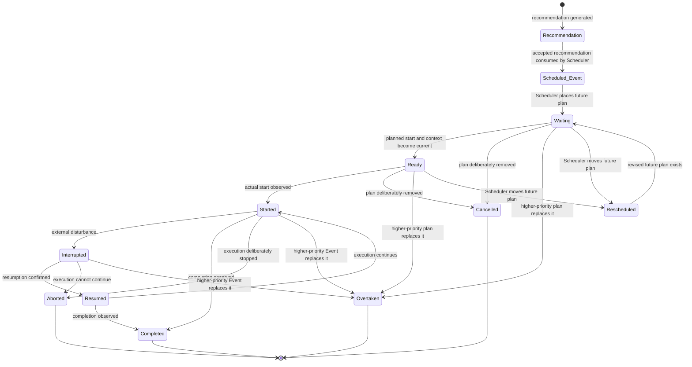
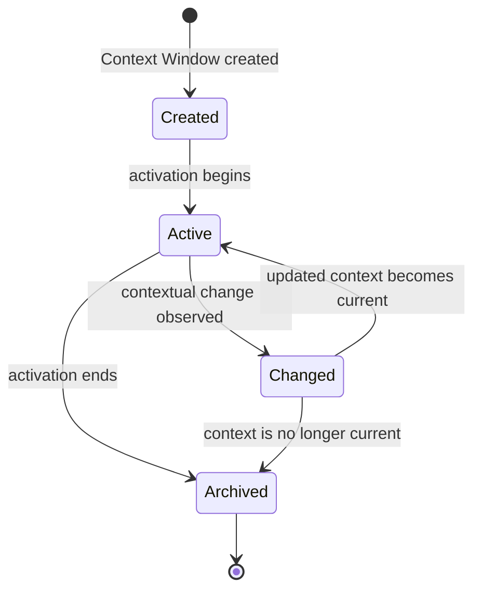
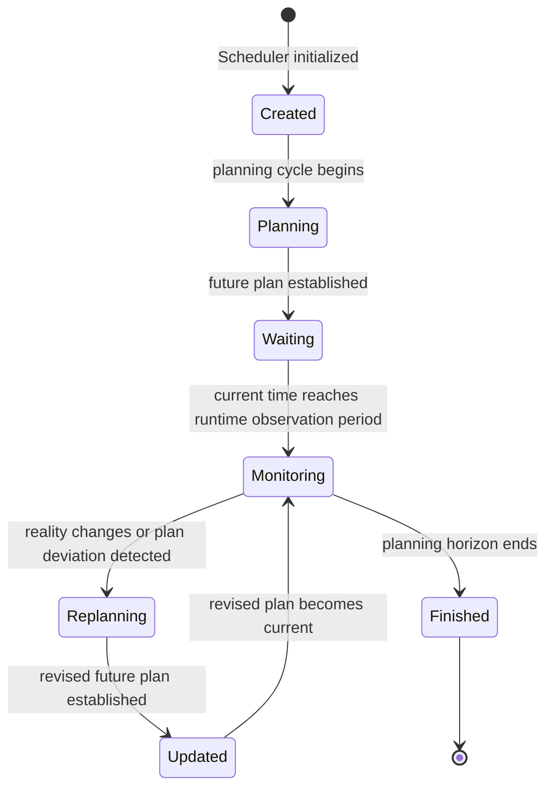
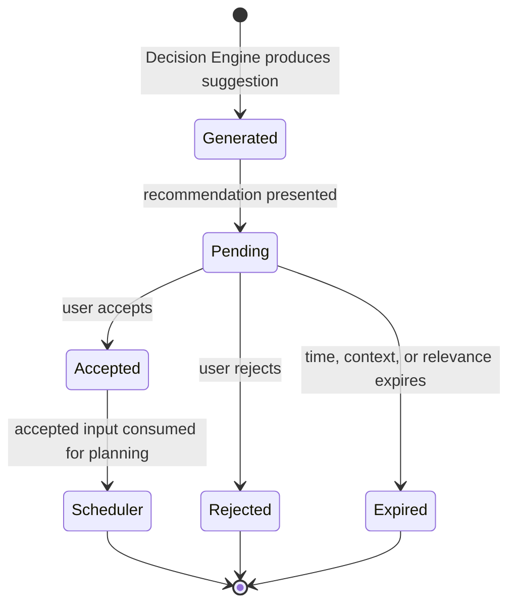
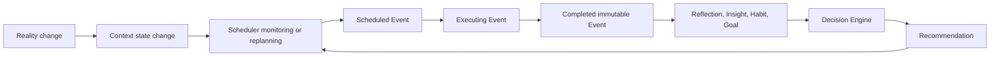

# PAIOS Behavioral State Machines

## Document Purpose

This document defines the behavioral state machines of the major runtime entities in PAIOS.

The Domain Model defines what these entities are. The Behavioral Architecture defines how the runtime observes, reasons, plans, executes, and learns. This document gives that behavior a precise lifecycle shape: which states exist, which changes are meaningful, and which explicit events or conditions may cause a transition.

This is a behavioral specification. It does not define persistence, APIs, algorithms, or implementation mechanisms.

---

## 1. Behavioral Philosophy

PAIOS is not driven by CRUD-style record updates. It is driven by changes in reality.

An entity changes state because something meaningful occurred: time progressed, the user acted, a Context changed, a Recommendation was accepted, an Event Disturber appeared, or a completed Event produced learning. A state machine makes that behavioral meaning explicit.

State machines exist in PAIOS to ensure that:

- Runtime entities move through observable, intentional lifecycles.
- The system can distinguish a future plan from an action that actually happened.
- Reality can override planning without rewriting History.
- Every transition has a named behavioral trigger or condition.
- Completed history remains immutable.

The central separation remains:

```text
Recommendation → Scheduler → Scheduled Event → Executing Event → Completed Event
```

A Recommendation does not become an Event directly. The Scheduler converts accepted planning input into a Scheduled Event. An actual start creates an Executing Event. Completion makes that Event immutable History.

---

## 2. State Categories

PAIOS state machines fall into four behavioral categories. These categories describe the role an entity plays while the system is running; they do not change ownership or domain relationships.

### Executable Objects

Executable Objects represent work that may be planned or performed in reality.

- **Scheduled Event** — a future, Scheduler-owned plan.
- **Event** — an action being performed or completed as History.
- **Project** — an intentional body of work whose progress is evidenced by Events.

### Decision Objects

Decision Objects represent options, direction, and the outcomes of reasoning.

- **Recommendation** — a suggested future action.
- **Goal** — an emerging long-term direction.
- **Insight** — reusable learned understanding.

### Observation Objects

Observation Objects represent what the system observes or learns about reality.

- **Context Window** — a temporal activation of Context.
- **Reflection** — the user's interpretation of a completed Event.
- **Habit** — a behavioral pattern inferred from repeated Events.

### Planning Objects

Planning Objects continuously shape the future without changing History.

- **Scheduler** — the planning and replanning lifecycle.
- **Scheduled Event** — the concrete future output of planning.
- **Recommendation** — accepted input available to planning.

An entity may participate in more than one category where its role crosses a behavioral boundary. Scheduled Event, for example, is both an executable object and the concrete output of planning.

---

## 3. Event State Machine

### Purpose

The Event lifecycle describes the movement from a suggested action to a real action and, finally, immutable History. The Recommendation and Scheduled Event portions of this flow are separate entities; the Executing Event begins only when reality confirms that the action started.

### Lifecycle Diagram



### States

| State | Behavioral meaning |
|---|---|
| `Recommendation` | A possible future action exists as a suggestion. |
| `Scheduled Event` | The Scheduler has created a distinct future plan. |
| `Waiting` | The Scheduled Event exists but its planned execution opportunity has not arrived. |
| `Ready` | The planned opportunity is current and execution may begin. |
| `Started` | Actual execution has begun; an Executing Event now exists. |
| `Interrupted` | An external disturbance temporarily stopped execution. |
| `Resumed` | Interrupted execution has explicitly continued. |
| `Completed` | The action finished and is immutable History. |
| `Cancelled` | A future plan was deliberately removed before completion. |
| `Aborted` | Execution began but was deliberately or necessarily stopped before completion. |
| `Overtaken` | A higher-priority Event or plan replaced the current one. |
| `Rescheduled` | A future plan was moved to a revised future opportunity. |

### Transition Meaning

| Transition | Explicit trigger or condition |
|---|---|
| `Recommendation` → `Scheduled Event` | The user accepts the Recommendation and the Scheduler consumes it as planning input. |
| `Scheduled Event` → `Waiting` | The Scheduler places it into a future time and Context Window. |
| `Waiting` → `Ready` | Its planned start becomes current in a suitable Context Window. |
| `Ready` → `Started` | Actual user execution is observed or explicitly started. |
| `Started` → `Interrupted` | An Event Disturber or other external change interrupts execution. |
| `Interrupted` → `Resumed` | Resumption is explicitly confirmed. |
| `Resumed` → `Started` | Execution continues. |
| `Started` or `Resumed` → `Completed` | Completion is observed or explicitly confirmed. |
| `Waiting` or `Ready` → `Cancelled` | The future plan is deliberately removed. |
| `Started` or `Interrupted` → `Aborted` | Execution is explicitly ended without completion. |
| `Waiting`, `Ready`, `Started`, or `Interrupted` → `Overtaken` | A higher-priority Event or plan replaces the current one. |
| `Waiting` or `Ready` → `Rescheduled` | The Scheduler revises the future execution opportunity. |
| `Rescheduled` → `Waiting` | The revised future plan is established. |

### Alternate Path Definitions

**Interrupted** means execution was temporarily stopped by an external change. It preserves the expectation that the same Event may resume.

**Cancelled** means a future Scheduled Event was deliberately removed before actual execution began. It is not an Executing Event.

**Aborted** means actual execution began but ended without completion. It records partial reality rather than a cancelled plan.

**Overtaken** means a higher-priority Event or plan replaces the current one. This state is unique to PAIOS: it expresses a loss of priority caused by a better current decision, rather than a simple user cancellation or external interruption.

**Rescheduled** applies only to a future opportunity. It does not alter Event History and it does not turn a Completed Event back into a plan.

### Terminal States

`Completed`, `Cancelled`, `Aborted`, and `Overtaken` are terminal for that lifecycle path.

Completed Events are immutable. Later learning, reflection, or correction creates new behavioral evidence; it never changes the completed Event.

---

## 4. Context State Machine

### Purpose

Context describes the situation in which reality is occurring. A Context Window is the temporal activation of that Context. It evolves continuously and independently from the Event lifecycle.

### Lifecycle Diagram



### States

| State | Behavioral meaning |
|---|---|
| `Created` | A Context Window has been established but is not current. |
| `Active` | The Context Window currently describes the user's situation. |
| `Changed` | A meaningful change in the active situation has been observed. |
| `Archived` | The Context Window is no longer current and remains only as History. |

### Transition Meaning

| Transition | Explicit trigger or condition |
|---|---|
| `Created` → `Active` | The Context Window's activation begins. |
| `Active` → `Changed` | A location, person, environment, emotion, trigger, reason, or other contextual condition changes. |
| `Changed` → `Active` | The updated Context Window becomes the current situation. |
| `Active` or `Changed` → `Archived` | The Context Window ends or is replaced by a subsequent current Context Window. |

### Behavioral Notes

`Changed` is repeatable. A Context Window may move through `Active → Changed → Active` many times during the day as reality evolves.

Every Context Change may produce a Domain Event. That Domain Event can trigger Scheduler recalculation, but the Context Window does not itself decide how the schedule changes.

Context evolves independently from Events. An Event may occur within a Context Window, but an Event transition does not by itself force a Context transition.

---

## 5. Scheduler State Machine

### Purpose

The Scheduler is the planning object that continuously turns accepted Recommendations and current runtime conditions into future Scheduled Events. It is not a one-time plan generator.

### Lifecycle Diagram



### States

| State | Behavioral meaning |
|---|---|
| `Created` | The Scheduler is available but has not entered a planning cycle. |
| `Planning` | It is forming a future plan from current inputs. |
| `Waiting` | A future plan exists and the Scheduler is waiting for the next relevant runtime point. |
| `Monitoring` | It is comparing planned future activity with current reality. |
| `Replanning` | A meaningful reality change requires the future plan to be reconsidered. |
| `Updated` | A revised future plan has been established. |
| `Finished` | The defined planning horizon has ended. |

### Transition Meaning

| Transition | Explicit trigger or condition |
|---|---|
| `Created` → `Planning` | A planning cycle begins. |
| `Planning` → `Waiting` | A future plan is established. |
| `Waiting` → `Monitoring` | The next runtime observation period begins. |
| `Monitoring` → `Replanning` | A Context change, Event Disturber, resource change, time deviation, new accepted Recommendation, or other meaningful reality change occurs. |
| `Replanning` → `Updated` | A revised future plan is established. |
| `Updated` → `Monitoring` | The revised plan becomes the active plan under observation. |
| `Monitoring` → `Finished` | The planning horizon explicitly ends. |

### Behavioral Notes

The Scheduler continuously monitors reality rather than generating a fixed plan. It plans only the future and never changes Event History.

`Replanning` is triggered by changed reality, not by the existence of a CRUD update. The Scheduler may create, cancel, overtake, or reschedule future Scheduled Events as part of a changed future plan; completed Events remain untouched.

---

## 6. Recommendation State Machine

### Purpose

A Recommendation is a Decision Engine suggestion. It represents a possible future action, not a command, a Scheduled Event, or an Event.

### Lifecycle Diagram



### States

| State | Behavioral meaning |
|---|---|
| `Generated` | The Decision Engine has produced a suggestion. |
| `Pending` | The suggestion is available for user consideration. |
| `Accepted` | The user has explicitly accepted it as Scheduler input. |
| `Scheduler` | The accepted Recommendation has been handed to the Scheduler for planning. |
| `Rejected` | The user has explicitly declined the Recommendation. |
| `Expired` | The Recommendation is no longer relevant or valid. |

### Transition Meaning

| Transition | Explicit trigger or condition |
|---|---|
| `Generated` → `Pending` | The Recommendation is presented to the user. |
| `Pending` → `Accepted` | The user explicitly accepts it. |
| `Accepted` → `Scheduler` | The Scheduler consumes it as planning input. |
| `Pending` → `Rejected` | The user explicitly rejects it. |
| `Pending` → `Expired` | Its time, Context, resource, or relevance validity ends. |

### Behavioral Notes

Rejected Recommendations remain historical evidence. Rejection is meaningful behavioral feedback: it records that a suggestion was considered and not chosen. It may inform future reasoning, but it does not alter past Events.

The `Scheduler` state is not execution. It is the handoff boundary after acceptance. Only the Scheduler may create a Scheduled Event, and only actual execution may create an Event.

---

## 7. Design Notes

### Event Lifecycle

The Event state machine gives the Event Lifecycle its behavioral sequence. It explicitly separates suggestion, future planning, actual execution, interruption, completion, and immutable History.

### Runtime Loop

The Runtime Loop continually observes reality. Its observed changes provide the triggers that move Context Windows, Events, Recommendations, and the Scheduler through their state machines.

### Behavioral Architecture

These machines keep the Behavioral Architecture change-driven. A meaningful domain condition causes a transition; the transition makes runtime state understandable; that changed state may cause another component to respond.

### Decision Engine

The Decision Engine generates Recommendations from runtime state and History. It does not execute Events or alter History. Accepted Recommendations cross the Scheduler boundary, where they may become future Scheduled Events. Completed Events then become evidence for Reflection, Insight, Habit inference, Goal emergence, and better future Recommendations.



The result is a continuous behavioral loop: observe reality, understand its state, decide, plan, execute, learn, and respond to the next change.
