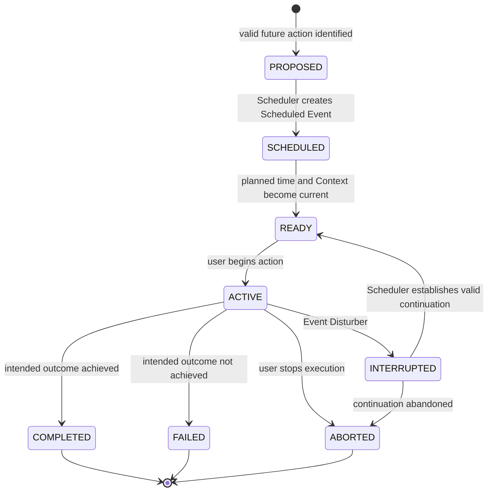
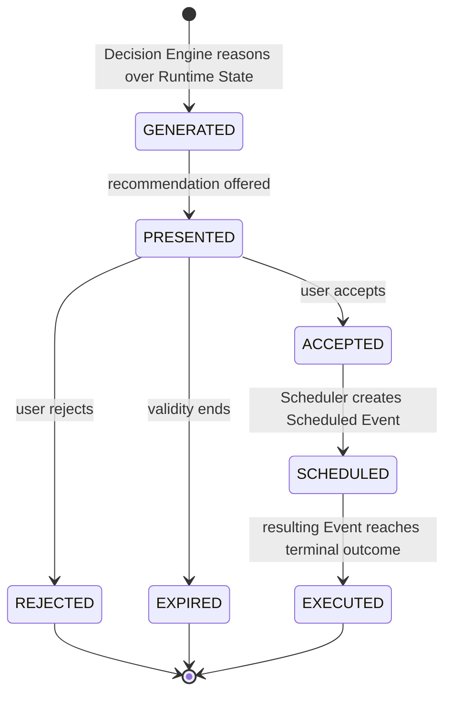
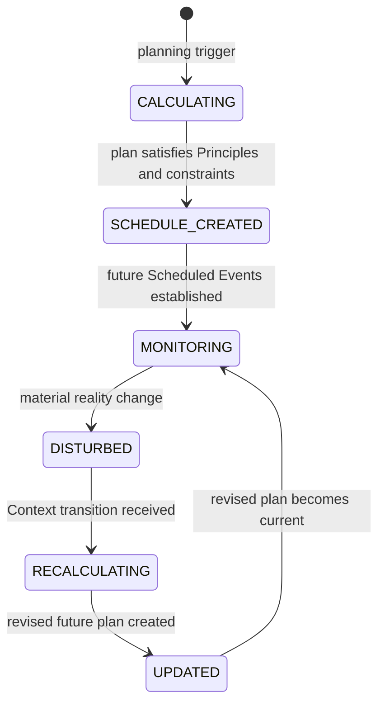
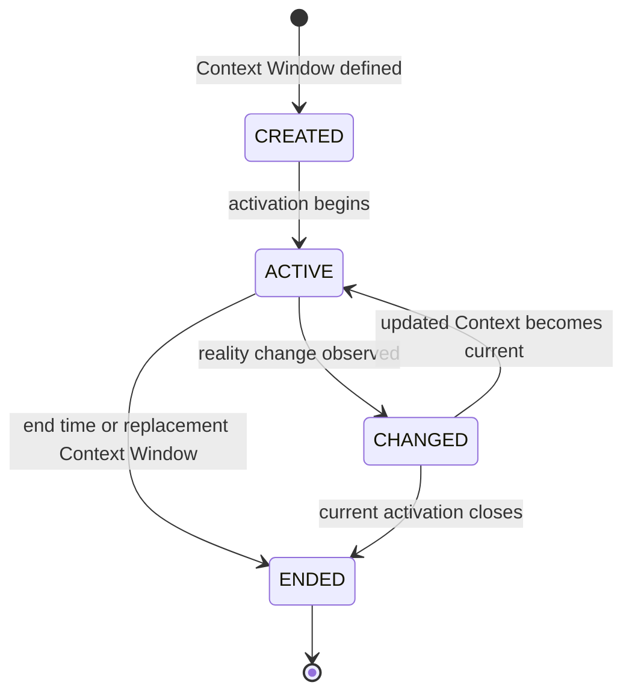
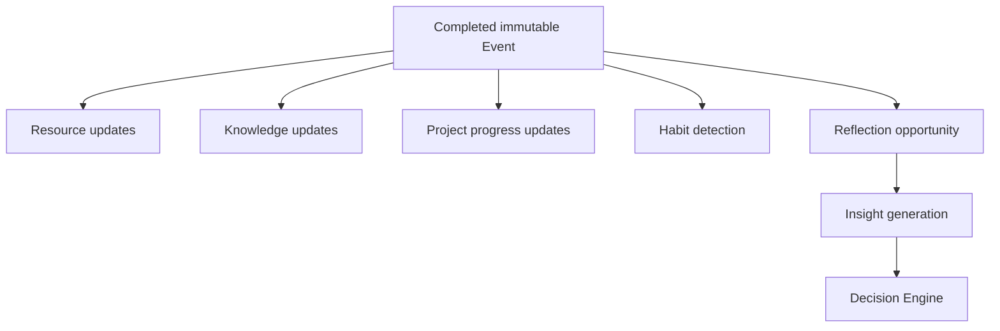

# PAIOS State Machine Design

## Document Purpose

This document defines the behavioral state machines of PAIOS. It applies Domain-Driven Design to the runtime lifecycle of Events, Recommendations, Scheduler planning, and Context Windows.

PAIOS is event-driven. State transitions record a change in behavior or reality; they do not rewrite History. Events are the source of truth, completed Events are immutable, the Decision Engine owns no data, and the Scheduler plans only future Scheduled Events.

This document contains no implementation design, API definition, or Task entity.

---

## Behavioral Invariants

- Every aggregate occupies exactly one state in its own state machine at a time.
- Every transition has an explicit trigger: user action, observed reality, system/domain event, clock condition, or authorized aggregate decision.
- Completed Event History is immutable. No transition may reopen or alter a `COMPLETED` Event.
- The Scheduler creates and changes only future Scheduled Events. It never modifies History.
- The Decision Engine is stateless and owns no data. Its output is Recommendation and planning input, never direct Event mutation.
- Principles constrain Recommendation generation, Scheduler planning, and every transition that selects a future action.
- An Event Disturber changes Context and triggers Scheduler recalculation; it does not directly mutate an Event.
- One User normally has one active Context Window and zero or one active Event at a time.

## Aggregate Ownership and Responsibilities

| Aggregate / component | Owns | Responsibility |
|---|---|---|
| Event | Executed Event lifecycle and immutable history | Record actual execution and its outcome. |
| Scheduler | Scheduled Events and future-plan changes | Create, monitor, recalculate, and revise the future plan. |
| Context Window | One temporal activation of a reusable Context | Represent the current runtime environment. |
| Recommendation | One Decision Engine suggestion | Capture a user decision about a possible future action. |
| Event Disturber | One unexpected reality change | Express the change and cause Context/Scheduler response. |
| Reflection | Interpretation of a Completed Event | Provide learning evidence without changing the Event. |
| Decision Engine | No domain data | Read state and History; generate Recommendations and planning input. |

---

# 1. Event State Machine

## Purpose

The Event state machine separates a proposed action, a future plan, actual execution, and immutable History. `PROPOSED` and `SCHEDULED` are planning-facing states; `ACTIVE` and later states describe actual Event behavior.

## States

| State | Meaning |
|---|---|
| `PROPOSED` | A Principle-aligned possible Event has been identified but is not yet scheduled. |
| `SCHEDULED` | Scheduler has created a future Scheduled Event in a Context Window. |
| `READY` | The scheduled opportunity is current and its required Context and Resources are available. |
| `ACTIVE` | The user has begun the action; an executing Event exists. |
| `COMPLETED` | The action ended successfully and is immutable History. |
| `INTERRUPTED` | An Event Disturber or changed reality temporarily stopped active execution. |
| `ABORTED` | Active execution ended before completion. Partial History remains. |
| `FAILED` | Execution reached an outcome that did not meet its intended result. History remains immutable. |

## Lifecycle Diagram



## Allowed Transitions

| From | To | Trigger | Owner | Example |
|---|---|---|---|---|
| `PROPOSED` | `SCHEDULED` | Accepted Recommendation is consumed for planning. | Scheduler | Accepted study suggestion is placed at 7:00 PM. |
| `SCHEDULED` | `READY` | Planned time arrives and Context/Resources satisfy preconditions. | Runtime | Home Context Window begins and energy is sufficient. |
| `READY` | `ACTIVE` | User begins the action. | Event | User starts studying. |
| `ACTIVE` | `COMPLETED` | Intended result is observed or explicitly confirmed. | Event | Study session finishes as planned. |
| `ACTIVE` | `FAILED` | Execution ends but intended result is not achieved. | Event | Exam attempt is completed but not passed. |
| `ACTIVE` | `ABORTED` | User explicitly ends execution before completion. | Event | User stops exercise because of pain. |
| `ACTIVE` | `INTERRUPTED` | Disturber causes Context transition and Scheduler response. | Scheduler | Emergency call interrupts study. |
| `INTERRUPTED` | `READY` | Scheduler establishes a valid future continuation. | Scheduler | Study is moved to a later suitable window. |
| `INTERRUPTED` | `ABORTED` | Continuation is explicitly abandoned. | Scheduler | The remaining session is no longer viable. |

## Invalid Transitions

- `PROPOSED → ACTIVE`: a proposed action must be scheduled and become ready before actual execution.
- `SCHEDULED → COMPLETED`: a future plan is not evidence of execution.
- `READY → COMPLETED`: actual execution must begin first.
- `COMPLETED → ACTIVE`, `INTERRUPTED`, or `READY`: completed History cannot reopen.
- `ABORTED → ACTIVE`: a later attempt creates a new Event.
- `FAILED → ACTIVE`: failed execution remains historical evidence; a retry is a new Event.
- Any Event state → a Recommendation state: Recommendations are Decision Engine outputs, not Event states.

## Scheduler, Disturber, Reflection, and Resource Relationships

Scheduler creates `SCHEDULED`, makes future opportunities `READY`, and may establish a continuation after `INTERRUPTED`. It never changes a `COMPLETED`, `FAILED`, or `ABORTED` Event.

An Event Disturber does not directly change Event state. Its required chain is:

```text
Event Disturber → Context Window change → Scheduler recalculation → Event transition, if needed
```

`COMPLETED`, `FAILED`, and `ABORTED` Events remain evidence for Resources, Knowledge, Progress, Habit detection, and Reflection. Resource effects record what actually occurred, including partial consumption or production; they do not erase or alter the Event.

---

# 2. Recommendation State Machine

## Purpose

A Recommendation is a possible future action generated by the Decision Engine. It is not a Task, a Scheduled Event, or an executed Event. User choice is explicit and occurs only while the Recommendation is `PRESENTED`.

## States

| State | Meaning |
|---|---|
| `GENERATED` | Decision Engine has produced a Principle-constrained suggestion. |
| `PRESENTED` | The user can consider the suggestion. |
| `ACCEPTED` | The user has authorized it as Scheduler input. |
| `REJECTED` | The user has declined it; the decision remains historical evidence. |
| `SCHEDULED` | Scheduler has consumed acceptance and created a Scheduled Event. |
| `EXECUTED` | A resulting Event reached a terminal execution outcome; the Recommendation is linked to that evidence. |
| `EXPIRED` | Time, Context, Resources, or changed reality made the suggestion invalid before scheduling. |

## Lifecycle Diagram



## Transition Rules

| From | To | Trigger | Responsibility |
|---|---|---|---|
| `GENERATED` | `PRESENTED` | Runtime presents Decision Engine output. | Runtime |
| `PRESENTED` | `ACCEPTED` | User accepts. | User |
| `PRESENTED` | `REJECTED` | User rejects. | User |
| `PRESENTED` | `EXPIRED` | Validity ends due to time, Context, Resources, or reality. | Runtime |
| `ACCEPTED` | `SCHEDULED` | Scheduler creates a Scheduled Event. | Scheduler |
| `SCHEDULED` | `EXECUTED` | Linked Event becomes `COMPLETED`, `FAILED`, or `ABORTED`. | Runtime |

## Invalid Transitions

- `GENERATED → ACCEPTED`: the user cannot decide before presentation.
- `PRESENTED → SCHEDULED`: Scheduler receives only accepted Recommendations.
- `REJECTED` or `EXPIRED → ACCEPTED`: terminal decision evidence cannot reopen.
- `SCHEDULED → ACTIVE`: Scheduler output is a Scheduled Event; Event execution is a separate lifecycle.
- `EXECUTED → SCHEDULED`: a new attempt requires a new Recommendation and future Scheduled Event.

Rejected Recommendations remain historical evidence. This preserves the user's decision and allows later reasoning to understand which suggestions were not chosen without changing Event History.

---

# 3. Scheduler State Machine

## Purpose

The Scheduler dynamically plans future Events. It observes runtime reality and changes only the future plan; it never executes user actions and never modifies History.

## States

| State | Meaning |
|---|---|
| `CALCULATING` | Scheduler is forming a future plan from accepted Recommendations and current constraints. |
| `SCHEDULE_CREATED` | A Principle-constrained future schedule has been created. |
| `MONITORING` | Scheduler observes the current plan against runtime reality. |
| `DISTURBED` | A material Context, Resource, time, priority, or Disturber change has invalidated plan assumptions. |
| `RECALCULATING` | Scheduler is revising only future Scheduled Events. |
| `UPDATED` | A revised future plan is ready to become current. |

## Lifecycle Diagram



## Transition Rules

| From | To | Trigger | Example |
|---|---|---|---|
| `CALCULATING` | `SCHEDULE_CREATED` | A valid future plan satisfies Principles, time, Context, and Resources. | Study is assigned to an available evening window. |
| `SCHEDULE_CREATED` | `MONITORING` | Scheduled Events become the active future plan. | The evening plan is now under observation. |
| `MONITORING` | `DISTURBED` | Runtime publishes material plan deviation. | Emergency meeting changes available time. |
| `DISTURBED` | `RECALCULATING` | Context Window transition is received. | Emergency Context Window becomes active. |
| `RECALCULATING` | `UPDATED` | Revised future plan satisfies constraints. | Study is moved after the emergency. |
| `UPDATED` | `MONITORING` | Revised Scheduled Events become current. | New study slot is monitored. |

## Rules

- The Scheduler is the sole owner of future Scheduled Events.
- A Disturber triggers Context change and then Scheduler response; it does not edit an Event directly.
- `RECALCULATING` may create, reschedule, cancel, or replace future Scheduled Events, but cannot modify completed Event History.
- Principles constrain every Scheduler state that selects or revises future action.

---

# 4. Context State Machine

## Purpose

Context Window is an active runtime environment, not merely Event metadata. It represents when a reusable Context is current and affects which Event candidates are appropriate, possible, or impossible.

## States

| State | Meaning |
|---|---|
| `CREATED` | A temporal Context Window has been defined. |
| `ACTIVE` | The Context Window is the current runtime environment. |
| `CHANGED` | A meaningful change to the active situation has been observed. |
| `ENDED` | The temporal activation is over and retained as History. |

## Lifecycle Diagram



## Transition Rules

| From | To | Trigger | Responsibility |
|---|---|---|---|
| `CREATED` | `ACTIVE` | Start time or observed activation. | Runtime |
| `ACTIVE` | `CHANGED` | Location, people, environment, reason, trigger, or time changes. | Runtime |
| `CHANGED` | `ACTIVE` | Updated Context Window is established as current. | Runtime |
| `ACTIVE` or `CHANGED` | `ENDED` | End time is reached or another Context Window replaces it. | Runtime |

## System-Event Relationship

`ACTIVE → CHANGED` may publish `ContextChanged`. The Scheduler receives that system/domain event and enters `DISTURBED` / `RECALCULATING` when the change materially affects the future plan.

The Decision Engine reads the active Context Window as a capability boundary. Context influences which Event candidates it may recommend; it does not own or alter Context data.

Invalid transitions include `ENDED → ACTIVE` (a later activation requires a new Context Window) and `CREATED → CHANGED` (a Context must become current before it can change).

---

# 5. Domain Event Model

## User Events

User Events record meaningful user actions in reality. Examples include beginning study, completing exercise, attending office, spending money, sleeping, or stopping an activity. They become immutable Event History once recorded.

User Events express what happened. They are the source of truth for later reflection and learning.

## System / Domain Events

System or Domain Events communicate meaningful state changes between runtime participants. They do not replace User Events and do not rewrite History.

Examples:

| Domain Event | Meaning | Typical reaction |
|---|---|---|
| `ContextChanged` | Active Context Window changed. | Scheduler evaluates whether recalculation is needed. |
| `DisturbanceDetected` | An Event Disturber was observed. | Context transition and Scheduler response begin. |
| `RecommendationGenerated` | Decision Engine produced a suggestion. | Runtime presents it to the user. |
| `ScheduledEventCreated` | Scheduler established a future plan. | Runtime monitors the future opportunity. |
| `EventCompleted` | An Event reached immutable completion. | Learning and reporting flows may begin. |
| `ReflectionCreated` | User provided interpretation of a Completed Event. | Reflection may be analyzed for Insight. |

## Completed Event Learning Effects

Completed Events are not overwritten by their effects. They provide immutable evidence from which the following updates may be derived:



- **Resource updates:** record resources actually consumed or produced by the Event.
- **Knowledge updates:** record learning gained, applied, revised, or retained through the Event.
- **Progress updates:** update the Progress owned by the Event's Project when one exists.
- **Habit detection:** compare repeated completed Event evidence to infer Habit patterns.

The Decision Engine may read these derived changes, but it owns none of them and never writes Event History.

---

## Design Summary

PAIOS state machines retain a strict separation of concerns:

```text
Decision Engine suggests
  ↓
User decides
  ↓
Scheduler plans future Scheduled Events
  ↓
User performs Events
  ↓
Completed Events become immutable History
  ↓
Reflection and learning improve future decisions
```

This separation preserves the core architecture: event-driven behavior, DDD aggregate boundaries, immutable History, Principles as constraints, and dynamic future scheduling without Task entities.
